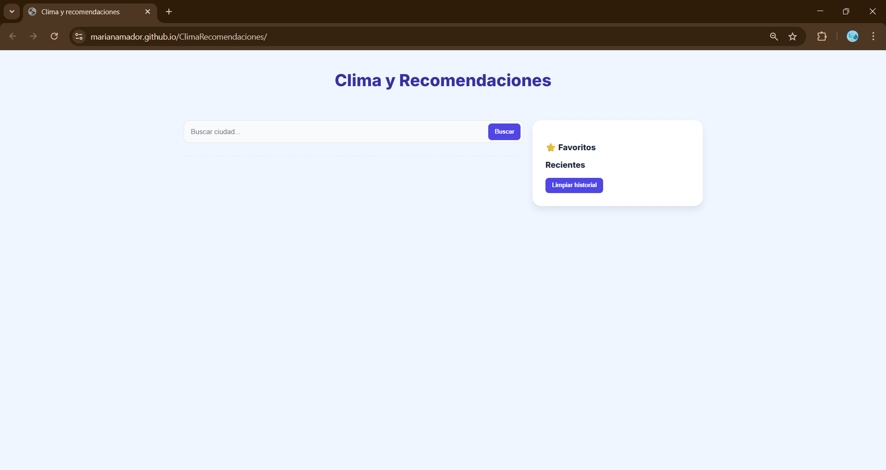
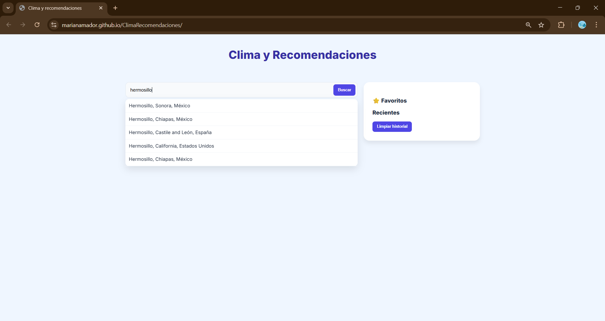
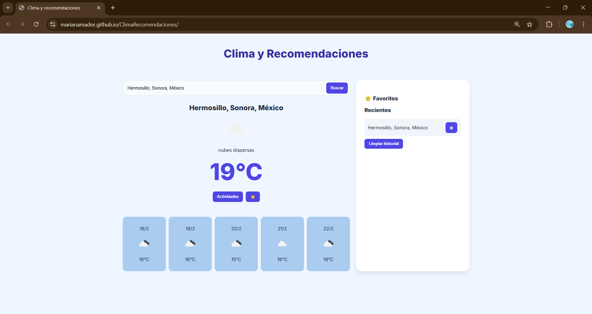
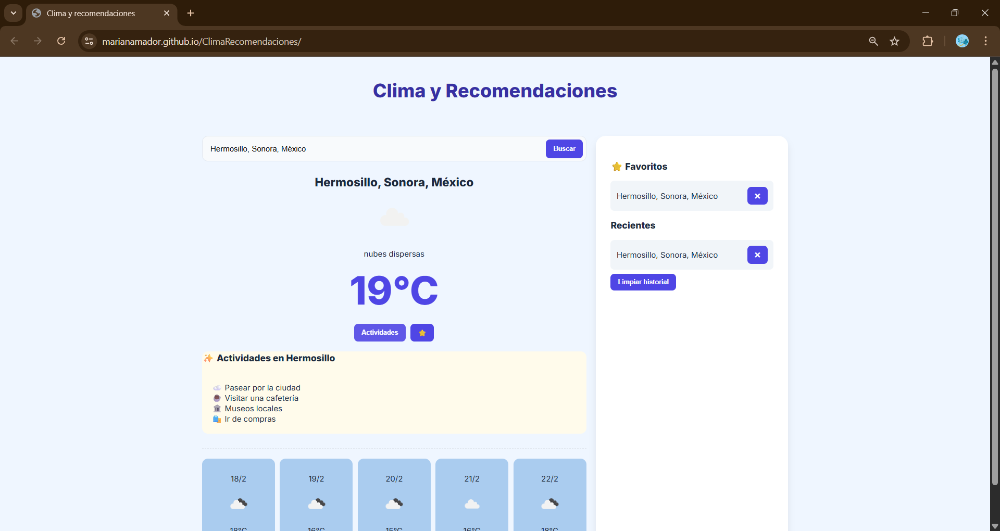
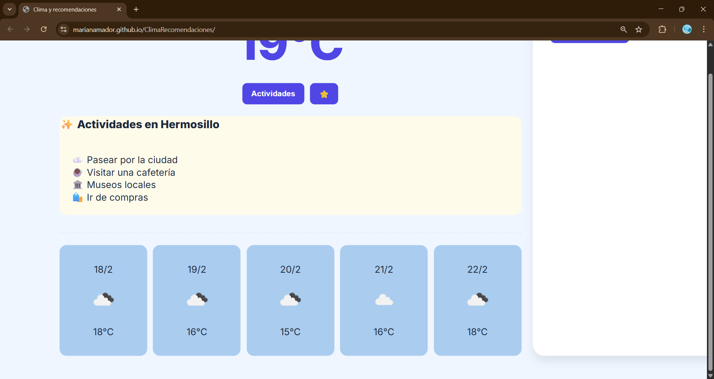
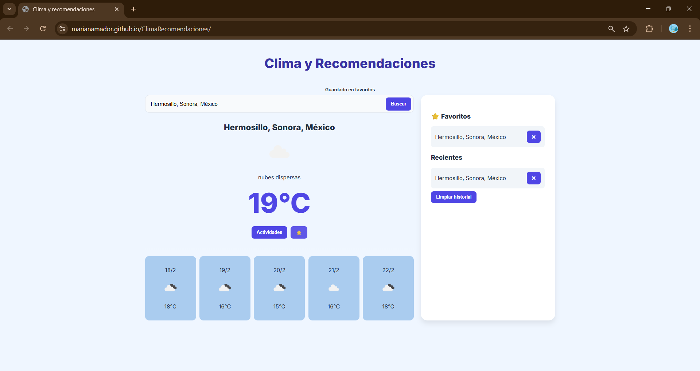
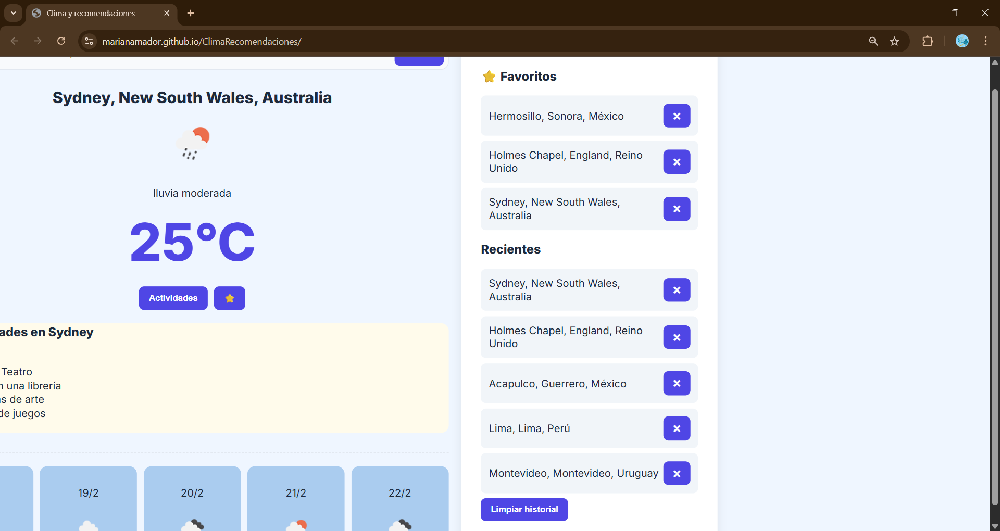
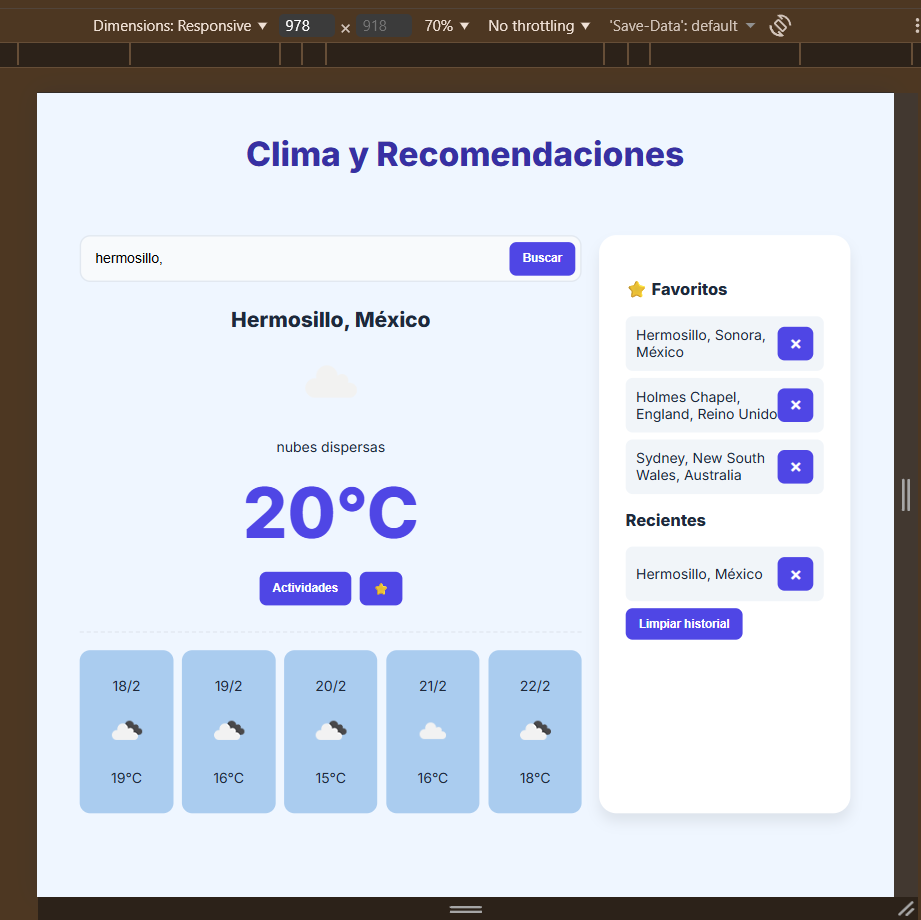

# ClimaRecomendaciones

Aplicación web que permite buscar una ciudad y consultar el clima actual, así como mostrar recomendaciones de actividades según las condiciones climáticas.  
Incluye sugerencias de ciudades con el mismo nombre en diferentes países, manejo de favoritos y registro de ciudades recientes para facilitar futuras consultas.

---

## Imágenes del programa

### Página principal

### Búsqueda y sugerencia de ciudades

### Vista del clima de la ciudad

### Actividades sugeridas

### Pronóstico de días posteriores

### Ciudades agregadas a favoritos

### Ciudades recientes y favoritos

### Responsividad

---

## Tecnologías utilizadas
- HTML5
- CSS3
- JavaScript (ES6)
- API OpenWeatherMap
- LocalStorage

---

## Probar la página

### Instalación local
1. Descargue el archivo ZIP del repositorio.
2. Descomprima el contenido en la carpeta de su preferencia.
3. Abra el archivo `index.html` en su navegador.

### Versión en línea
Puede probar la aplicación en el siguiente enlace:  
👉 https://marianamador.github.io/ClimaRecomendaciones/

